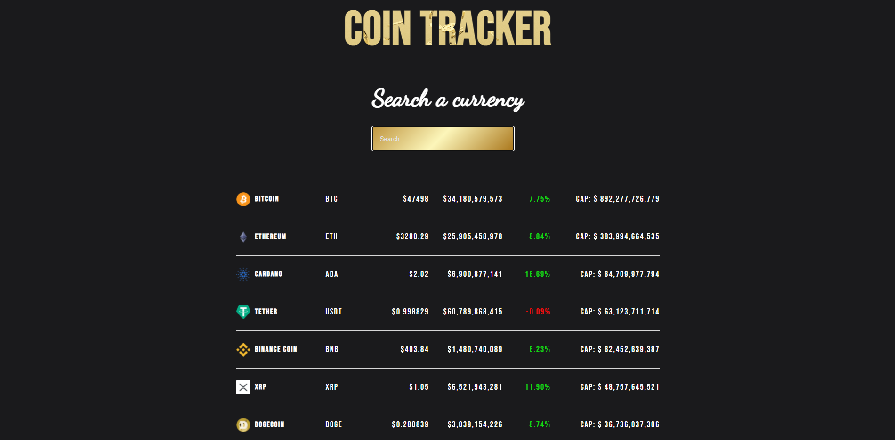

# Crypto Tracker

<h1>
        This is a Crypto Tracker app that shows current Coin status. I used
        CoinGecko API to render coins.
      </h1>
      
      <h3>
        Demo :
        <a href="https://crypto-tracker-epmjn00l8-bartugenccan.vercel.app/">
          https://crypto-tracker-epmjn00l8-bartugenccan.vercel.app/
        </a>
        </h3>
        

